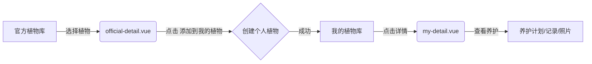

# 植物详情页面说明

## 📋 页面区分

项目中有两个不同的植物详情页面，分别用于不同的场景：

---

## 1️⃣ 我的植物详情页 (`my-detail.vue`)

**路由路径**: `/plant/my-detail/:id`  
**功能定位**: 查看用户已拥有的植物详细信息

### 主要功能
- ✅ 展示用户个人植物库中的植物
- ✅ 显示植物的养护计划、养护记录、成长照片
- ✅ 提供备注信息编辑功能
- ✅ 快速添加养护计划、记录、照片
- ✅ 统计该植物的养护数据

### 数据来源
- 接口：`GET /api/my-plant/{id}`
- 表：`my_plant`（用户个人植物表）

### 典型使用场景
1. 用户点击"我的植物库"列表中的某株植物
2. 查看该植物的详细养护历史
3. 管理该植物的养护计划和照片

### 页面特色
- 🎨 顶部横幅背景图（使用植物封面）
- 📊 三个标签页：养护计划、养护记录、成长相册
- 💡 悬浮操作按钮（FAB），快速添加相关记录
- 📝 备注信息卡片

---

## 2️⃣ 官方植物库详情页 (`official-detail.vue`)

**路由路径**: `/plant/official/:id`  
**功能定位**: 查看植物百科知识库，可添加到个人植物库

### 主要功能
- ✅ 展示官方植物库的植物信息
- ✅ 显示植物的科学分类（属、种）
- ✅ 提供详细的养护指南（光照、浇水、温度等）
- ✅ 支持"添加到我的植物"功能
- ✅ 植物百科知识查询

### 数据来源
- 接口：`GET /api/plant/official/{id}`
- 表：`official_plant`（官方植物库表）

### 典型使用场景
1. 用户在"官方植物库"中浏览
2. 查询某种植物的养护知识
3. 将喜欢的植物添加到个人植物库

### 页面特色
- 📖 基本信息卡片（科属、养护难度、花期等）
- 🌱 养护指南折叠面板（光照、浇水、温度、土壤、病虫害）
- 🖼️ 顶部植物图片展示
- ➕ 底部操作栏："添加到我的植物"按钮

---

## 🔄 两者的关系



### 数据流转
1. **官方植物库** → `official_plant` 表（植物百科知识库）
2. **用户添加植物** → 从 `official_plant` 复制数据到 `my_plant` 表
3. **我的植物库** → `my_plant` 表（用户的个人植物）

---

## 🎯 使用示例

### 场景 1: 查询植物养护知识
```
用户路径：官方植物库 → 植物详情 (official-detail.vue)
目的：学习如何养护绿萝
```

### 场景 2: 管理个人植物
```
用户路径：我的植物库 → 植物详情 (my-detail.vue)
目的：查看我家绿萝的养护记录和照片
```

### 场景 3: 添加新植物
```
1. 在官方植物库中找到目标植物
2. 点击进入详情 (official-detail.vue)
3. 点击"添加到我的植物"
4. 填写个性化信息（昵称、位置等）
5. 在我的植物库中查看 (my-detail.vue)
```

---

## 📁 文件位置

- **我的植物详情**: `plant-frontend/src/pages/plant/my-detail.vue`
- **官方植物详情**: `plant-frontend/src/pages/plant/official-detail.vue`
- **我的植物列表**: `plant-frontend/src/pages/plant/my-list.vue`
- **官方植物列表**: `plant-frontend/src/pages/plant/official.vue`

---

## 🔧 开发注意事项

### API 路径
- 我的植物：`/api/my-plant/*`
- 官方植物：`/api/plant/official/*`

### 关键区别
| 特性 | 我的植物 (my-detail.vue) | 官方植物 (official-detail.vue) |
|------|------------------------|------------------------------|
| 数据来源 | `my_plant` 表 | `official_plant` 表 |
| 用户群体 | 已登录用户 | 所有用户 |
| 主要功能 | 养护管理 | 知识查询 |
| 可编辑性 | 可编辑备注、状态等 | 只读 |
| 关联功能 | 计划、记录、照片 | 添加到我的植物 |

---

## ✅ 测试验证

### 测试我的植物详情
```bash
1. 登录系统
2. 访问：http://localhost:5173/plant/my-list
3. 点击任意植物卡片
4. 应该跳转到 my-detail.vue 页面
5. 能看到养护计划、记录、照片
```

### 测试官方植物详情
```bash
1. 访问：http://localhost:5173/plant/official
2. 点击任意植物的"详情"按钮
3. 应该跳转到 official-detail.vue 页面
4. 能看到植物百科信息和养护指南
5. 点击"添加到我的植物"应该能成功添加
```

---

**最后更新**: 2026-04-03  
**维护者**: Greenly Team
